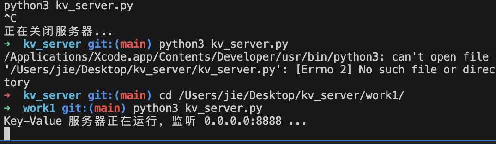
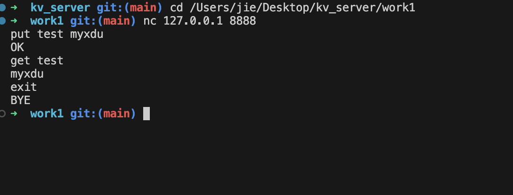

# 分布式计算 - 第一次作业

- **课程**：分布式计算（西电软工大三下学期）
- **教师**：王黎明

以下是核心逻辑的详细剖析：

### 1\. 服务器初始化与线程锁 (\__init_\_)

```python
self.store = {} # 内存 Key-Value 字典  
self.lock = threading.Lock() # 互斥锁  
self.server_socket = socket.socket(socket.AF_INET, socket.SOCK_STREAM)  
self.server_socket.setsockopt(socket.SOL_SOCKET, socket.SO_REUSEADDR, 1) 
``` 

- **数据存储**：使用 Python 原生的字典 self.store 作为内存数据库。
- **并发控制**：由于字典在多线程并发读写时非线程安全，引入了 threading.Lock()。在任何修改或读取 store 的地方加锁，防止出现竞态条件（Race Condition）。
- **端口复用**：设置 SO_REUSEADDR，避免服务器重启时出现 "Address already in use" 的端口占用报错。

### 2\. 主线程：连接分发 (start)

```python
while True:  
conn, addr = self.server_socket.accept()  
client_thread = threading.Thread(target=self.handle_client, args=(conn, addr))  
client_thread.daemon = True  
client_thread.start()  
```

- 服务器启动后进入死循环，accept() 方法阻塞等待客户端的 TCP 连接。
- 一旦有新客户端接入（如 JMeter 的并发请求），主线程会立刻拉起一个全新的子线程 client_thread 去专门服务该客户端。
- **守护线程**：设置为 daemon = True，确保主线程意外退出时，所有子线程会立刻随之销毁，防止僵尸进程。

### 3\. 子线程：长连接处理 (handle_client)

```python
with conn:  
while True:  
data = conn.recv(1024)  
if not data:  
break  
request = data.decode('utf-8').strip()  
response = self.process_command(request)  
conn.sendall((response + '\\n').encode('utf-8'))  
```

- **长连接维持**：子线程内部使用 while True 持续接收当前客户端的数据，直到客户端主动断开（返回空数据）或发送 EXIT 指令。
- **协议分隔**：读取字节流后解码，并使用 .strip() 去除首尾的空白符（包括 \\n 和 \\r），确保提取出纯净的指令字符串。
- **响应格式**：在返回给客户端的响应末尾严格追加了 \\n。这是为了适配诸如 JMeter 等压测工具的 TCP 采样器（EOL 字节值配置为 10），防止客户端因等不到换行符而发生阻塞死锁。

### 4\. 业务逻辑与互斥锁 (process_command)

```python
if cmd == 'PUT' and len(parts) >= 3:  
key = parts[1]  
value = ' '.join(parts[2:])  
with self.lock:  
self.store[key] = value  
return "OK" 
``` 

- **指令解析**：通过字符串的 .split() 方法切分指令和参数，并统一转为大写判断。支持 value 中包含空格（通过 ' '.join 拼接）。
- **原子操作**：在执行 self.store\[key\] = value（写入）、self.store.get(key)（读取）和 del self.store\[key\]（删除）时，严格使用 with self.lock: 获取互斥锁。这确保了在极高并发的 JMeter 压测下，内存数据的读写依然保持强一致性。

## 运行与压测截图

### 1\. 服务器终端运行状态





### 2\. JMeter 并发性能测试结果
